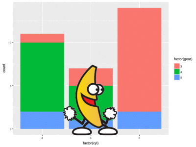

```{r setup, include=FALSE}
knitr::opts_chunk$set(echo = TRUE)
```


# Headline level 1

##blockquote

>Hola
>
>> hi world
>
>2+3
> For aggregate code you need insert 3 tabs
>     2+2


## R Markdown

This is an R Markdown document. Markdown is a simple formatting syntax for authoring HTML, PDF, and MS Word documents. For more details on using R Markdown see <http://rmarkdown.rstudio.com>.

When you click the **Knit** button a document will be generated that includes both content as well as the output of any embedded R code chunks within the document. You can embed an R code chunk like this:

```{r cars}
summary(cars)
```

## Including Plots

You can also embed plots, for example:

```{r pressure, echo=FALSE}
plot(pressure)
```

Note that the `echo = FALSE` parameter was added to the code chunk to prevent printing of the R code that generated the plot.

Note how we can change figure width and height
```{r pressure2,  fig.width=5, fig.height=5, echo=FALSE}
plot(pressure)
```

## Tables with Kable

```{r}
head(cars)
```

### Tables with Kable packages
```{r cars2, }
knitr::kable(head(cars), caption = "top six cars dataset")
```

## Equations

Here is footnote reference [^11] 

$$Y_i = \beta_0 + \beta_1x_i + \epsilon_i$$

## Images

Inserting image from local drive


Inserting images from web link


## Insert an Animated gif and video




## Footnotes


Here is footnote reference [^1] and  another[^longnote]
here is a inline footnote ^[in line notes are easier to write]

[^1]: my first footnote
[^11]: test footnote
[^longnote]: here's one with multiple blocks

